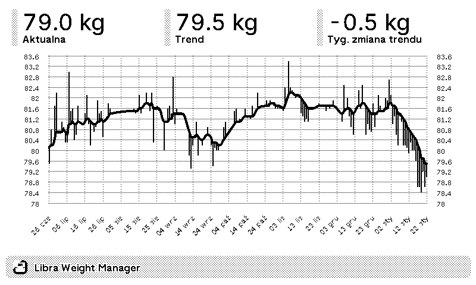

# TRMNL Libra Plugin

Unofficial Libra plugin for TRMNL.



## Details
Libra is an Android app designed to help you track your weight. For subscribers, it offers an API that allows access to historical weight data stored on their server.  
This plugin fetches that data and sends it to TRMNL, displaying it on an e-ink screen as a chart along with key statistics.

## Requirements
This code interacts with both the Libra REST API and the TRMNL webhook API. You will need to host and execute the code yourself to periodically push updated weight data from Libra to TRMNL.

## Setup
1. In TRMNL, navigate to **Plugins -> Private Plugin -> Add New**. Assign it a name and select "Webhook" as the strategy. Save the settings.
2. Copy the Plugin UUID and your TRMNL API key.
3. Download the code and rename the ``.env_template`` file to ``.env``. Then populate it as follows:
```
TRMNL_API_KEY=<your api key>
TRMNL_PLUGIN_ID=<your plugin UUID>
LIBRA_API_KEY=<your libra api key>
LIBRA_WEEKS=<number of weeks for which to fetch data>
```
To obtain your Libra API key, open the Libra app on your Android device, tap **Settings** (gear icon), go to **Libra Cloud**, then open the three-dot menu and select **Libra Cloud API**.

4. Copy the contents of ``template.html.liquid`` and paste it into the markup section of your TRMNL plugin.
5. Run ``gem install dotenv``
5. Run ``src/main.rb``. If it successfully posts data to TRMNL, you are all set. You can refresh the TRMNL interface to check if the data is visible.

To keep the data updated, you can schedule the script to run at regular intervals according to your needs.

## Disclaimer

This plugin is an unofficial project and is not affiliated with, endorsed by, or supported by Libra.

### Links

- https://help.usetrmnl.com/en/articles/9510536-private-plugins
- https://usetrmnl.com/framework
- https://github.com/Shopify/liquid
- https://github.com/usetrmnl/plugins
- https://docs.usetrmnl.com/go/private-plugins/create-a-screen
- https://libra-app.eu/api/
- https://github.com/eindpunt/awesome-TRMNL

### Check out my other private TRMNL plugins.
- https://github.com/sejtenik?tab=repositories&q=trmnl-